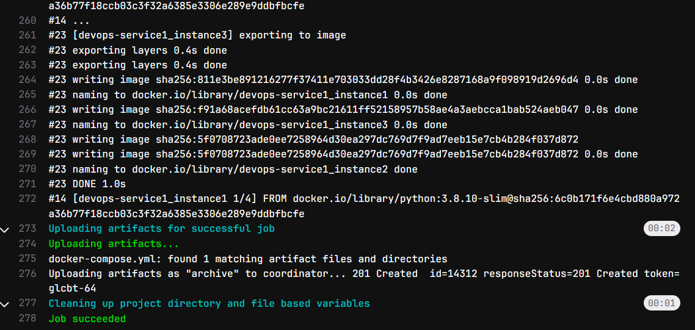
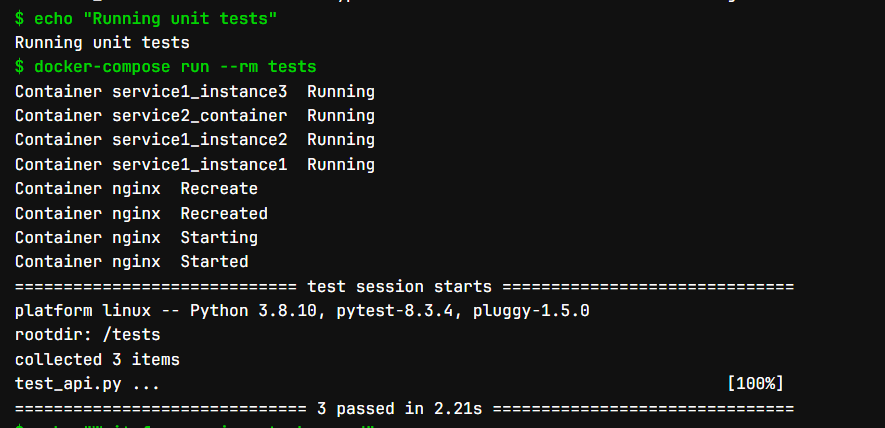
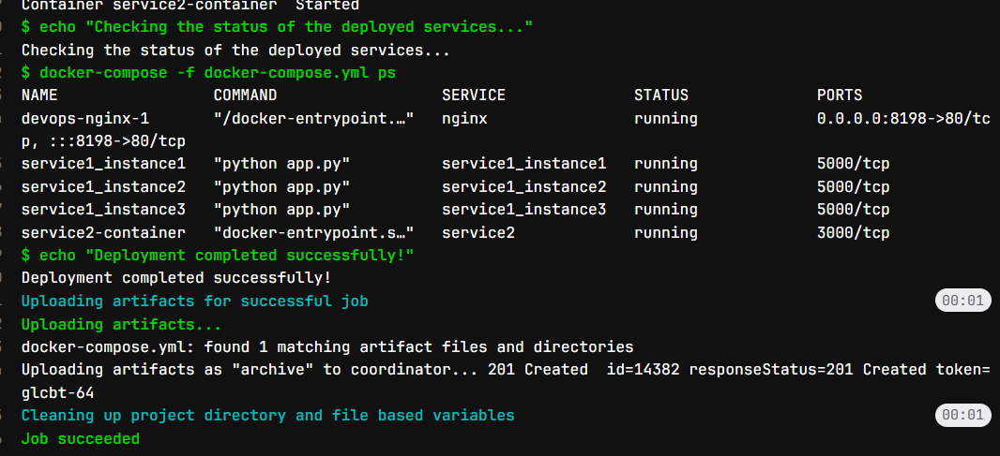
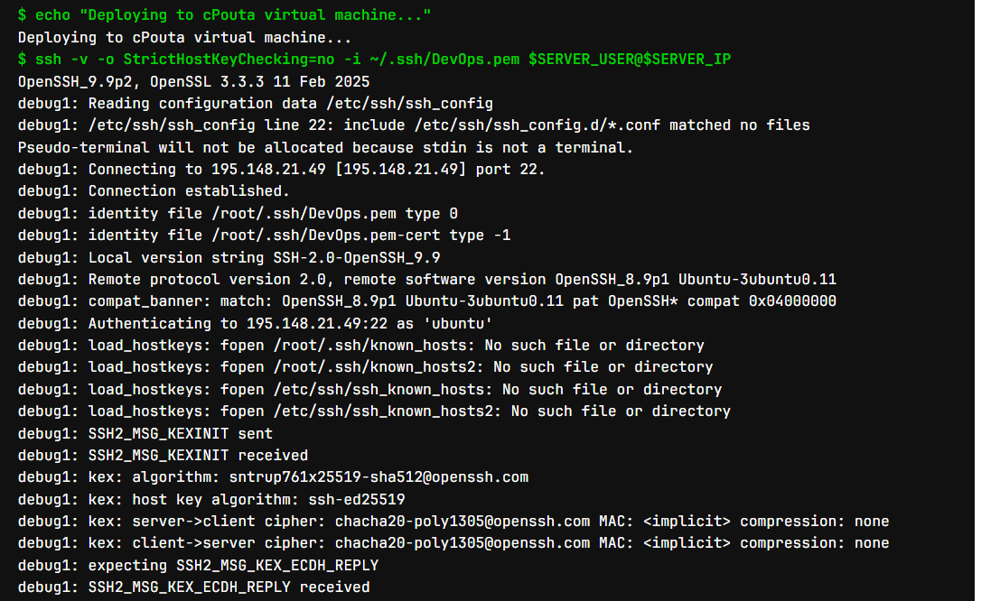
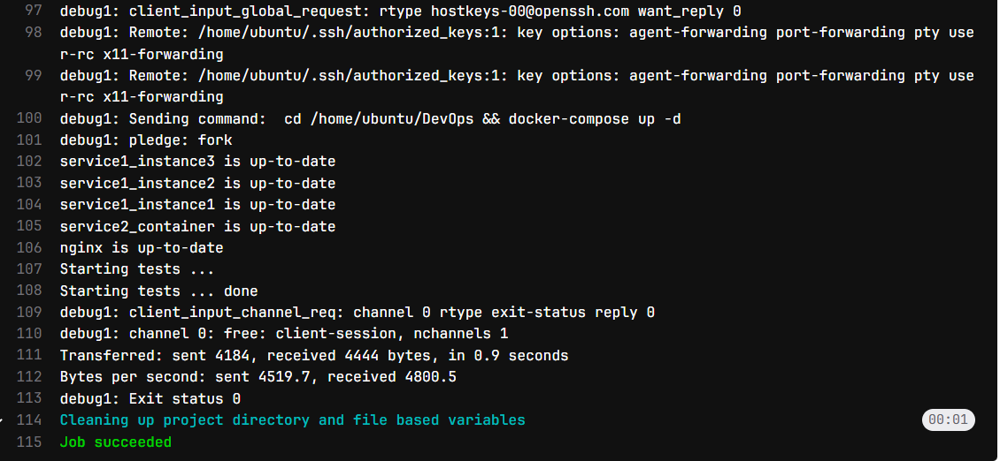

# DevOps

## Overview

This DevOps project 2 services using Python and JavaScript. The project use Docker Compose to create 2 different containers and use Nginx Load Balancer to map to each container. This project further implemented CI/CD pipeline using gitlab-runner. Furthermore, this project also develops based testdriven development method and add multiple API functionalities.

### System Requirement
The current option that is used for the operating system is virtual box. The
virtual environment is given with these hardward specifications:
- Processor: 6-core CPU
- Memory: 19GB
- Storage: 60 GB
Software
Operating system
- Ubuntu 20.04.6
Development tools:
- Frontend: Flask
- Backend: Flask, Express.js
- Test framework: pytest
Additional tools:
- Docker 27.5.1
- Nginx 1.18.0

### Instruction to run locally
Clone the repository from this link:

```
git clone https://github.com/ChuDucAnh242002/DevOps.git
```

Manually testing the server with docker-compose without using the test’s cases:

```
docker-compose build or docker compose build
docker-compose up --scale tests=0 Or docker compose up --scale tests =0
```

The server will listen at localhost:8198

### Testing functioalities locally
In order to test the functionalities locally with curl, the cookies.txt file is needed. There is curl-config.txt file there and it will use the cookies.txt. Use the curl function:

```
curl -K curl-config.txt http://localhost:8197/
```

To get the state:

```
curl -K curl-config.txt http://localhost:8197/state
```

To change the state:

```
curl -K curl-config.txt http://localhost:8197/state -X PUT -d “RUNNING” -H “ContentType: text/plain” -H “Accept: text/plain”
```

## Description of CI/CD pipeline

There are 3 stages in Gitlab pipeline, build, test and deploy. The gitlab runner uses
docker in docker with the service’s name docker:20.10.21-dind.

Build: bulid will use docker-compose bulid to build the in the current directory. The
image used to build is docker:20.10.21.

Test: The test will first docker-compose up --scale tests=0 in order for the tests
container to not run. After all other services are running, the tests container will run
with command docker-compose run --rm tests. Pytest will look for all the test’s cases
and execute them one by one. After all the tests passed, docker-compose down to shut
down all the docker continers and also delete all the containers.

Deploy: The deploy stage will try to copy the key to the docker container which uses
image alpine:latest. The docker container will access to the CPouta virtual machine and
deploy locally within the server.

## Runs of pipeline











